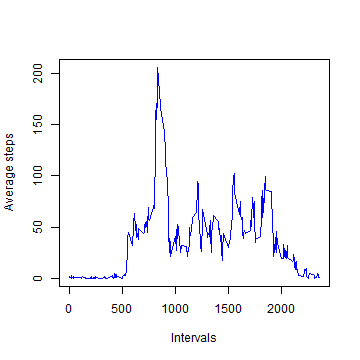
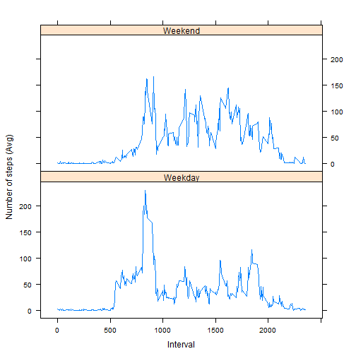

## Introduction
This assignment uses the data which were acquired from a personal activity
monitoring device. The data were acquired every five minutes from October
to December, 2012 from the device of an anomymous person.

## Loading and preprocessing data
First, I tried loading and preprocessing data.

1. Load the data file.
2. Preprocess them if necessary.


```r
zipfile <- 'activity.zip'
datafile <- 'activity.csv'

# Download zip file if it hasn't been downloaded yet.
setInternet2(TRUE)
if (!file.exists(zipfile)) {
  download.file('https://d396qusza40orc.cloudfront.net/repdata%2Fdata%2Factivity.zip',
                destfile=zipfile)
}

# unzip the file if necessary.
if (!file.exists(datafile)) {
  unzip(zipfile)
}

# Load the uncompressed csv data.
csvData <- read.csv(file=datafile, header=T, na.strings = "NA")
head(csvData)
```

```
##   steps       date interval
## 1    NA 2012-10-01        0
## 2    NA 2012-10-01        5
## 3    NA 2012-10-01       10
## 4    NA 2012-10-01       15
## 5    NA 2012-10-01       20
## 6    NA 2012-10-01       25
```

## What is the mean total number of steps per day?
1. Split the csv data with the date field.
2. Calculate the total step values per day (NAs in the step field should be ignored)
 Make a histgram of the total step per day.  
3. Write the summary of the total step value data.  
 The mean total number of steps is 9354.


```r
# Split the csv data with date field.
stepdata <- split(csvData, csvData$date)

# Calculate the total step values per day.
totalSteps <- sapply(stepdata, function(x) {
  sum(x[, "steps"], na.rm=TRUE)
})

# Make a histgram of the total step per day.
hist(totalSteps, xlab="Total steps", ylab="Tht number of days",col="blue")
```

 

```r
# Write the summary of the data
summary(totalSteps)
```

```
##    Min. 1st Qu.  Median    Mean 3rd Qu.    Max. 
##       0    6778   10400    9354   12810   21190
```

## What is the average daily activity pattern?
### Make a timeseries plot
1. Split the csv data with the interval field.
2. Calculate the average step values for each interval(NAs in the step field
should be ignored).
3. Plot the calculated data.


```r
# Split the csv data with interval field.
intStepData <- split(csvData, csvData$interval)

# Calculate the average step values for each interval.
aveSteps <- sapply(intStepData, function(x) {
  mean(x[,"steps"], na.rm=TRUE)
})

plot(names(aveSteps), aveSteps, type="l", 
     xlab="Intervals", ylab="Average steps", col="blue")
```

 

### Which 5-minute interval, on average across all the days in the dataset,
contains the maximum number of steps?

1. Sort the list which contains average steps in each intervals in
descending order.
2. Get the first item name in the sorted list.


```r
print(names(sort(aveSteps, decreasing=TRUE)[1]))
```

```
## [1] "835"
```
## Imputing missing pattern.
### Get the number of rows which contain NAs.
The number of the occurrance of NAs in the interval field is calculated
as follows:

   * Get the total number of rows in the dataset. ...(1)
   * Get the total number of rows in the dataset in which NAs are excluded
   from the original one. ...(2)
   * Substract (2) from (1)
   

```r
nrow(csvData) - nrow(na.omit(csvData))
```

```
## [1] 2304
```

### Create a new dataset.
Create a new dataset that is equal to the original dataset but 
with the missing data filled in.  
My strategy is as follows:
 
* substitute NAs with the average steps across all days.
* when trying to do them, the interval value of NAs is used.


```r
naIndex <- which(is.na(csvData))
inpData <- csvData
for (idx in naIndex) {
#  print(averageStepsInterval[as.character(inpData[idx,"interval"])])
  inpData[idx,"steps"] <- aveSteps[as.character(inpData[idx,"interval"])]
}
str(inpData)
```

```
## 'data.frame':	17568 obs. of  3 variables:
##  $ steps   : num  1.717 0.3396 0.1321 0.1509 0.0755 ...
##  $ date    : Factor w/ 61 levels "2012-10-01","2012-10-02",..: 1 1 1 1 1 1 1 1 1 1 ...
##  $ interval: int  0 5 10 15 20 25 30 35 40 45 ...
```

### Make a histogram of the new dataset
Make a histogram of the total number of steps taken each day 
and calculate and report the mean and median total number of
steps taken per day.


```r
splitInpData <- split(inpData, inpData$date)
totalStepsInpData <- sapply(splitInpData, function(x) {
  sum(x[,"steps"])
})
hist(totalStepsInpData, xlab="Total steps", ylab="# of days", col = "blue")
```

 

```r
mean(totalStepsInpData)
```

```
## [1] 10766.19
```

```r
median(totalStepsInpData)
```

```
## [1] 10766.19
```

The histgram described above indicates that its shape 
looks like a standard deviation when compare to the one
which was made from the original step data.
Since I interpolated the average number of steps in a 
5-minite interval across all days, the degree of this 
histgram gathered around the average steps value.

## Are there differences in activity patterns between weekdays and weekends?
1. Create a new factor variable in the dataset with two levels,
gweekdayh and gweekendh, indicating whether a given date is 
a weekday or a weekend.

 * Use the dataset with the filled-in missing values for this part.
 * Use weekdays() function to get the day of the week.  
   Note that The place where I live is Japan, so the default locale 
   is Japanese. That's why I was faced with some cumbersome problems
   related to locale (sometimes weekdays function returns a wrong
   result.), so tempolarily I changed the locale to C, and made 
   all weekday data in UTC, and restored the original locale.
   

```r
# download lattice package, if necessary.
if ("lattice" %in% installed.packages() == FALSE) {
  install.packages("lattice")
}
library(lattice)

oldLocale <- Sys.getlocale("LC_TIME")
Sys.setlocale(category="LC_TIME", locale="C")
```

```
## [1] "C"
```

```r
# get date data from inpData and check if the date is a weekday
# with weekday function.
weekdayData <- weekdays(strptime(inpData$date, format="%Y-%m-%d"))
weekdayData <- ifelse(weekdayData != "Saturday" & weekdayData != "Sunday", "Weekday", "Weekend")
# incorporate a weekday field into inpData.
inpData$weekday <- weekdayData
str(inpData)
```

```
## 'data.frame':	17568 obs. of  4 variables:
##  $ steps   : num  1.717 0.3396 0.1321 0.1509 0.0755 ...
##  $ date    : Factor w/ 61 levels "2012-10-01","2012-10-02",..: 1 1 1 1 1 1 1 1 1 1 ...
##  $ interval: int  0 5 10 15 20 25 30 35 40 45 ...
##  $ weekday : chr  "Weekday" "Weekday" "Weekday" "Weekday" ...
```

```r
Sys.setlocale(category = "LC_TIME", locale=oldLocale)
```

```
## [1] "Japanese_Japan.932"
```

2. Make a panel plot containing a time series plot (i.e. type = "l") 
of the 5-minute interval (x-axis) and the average number of steps 
taken, averaged across all weekday days or weekend days (y-axis).

  * Use subset & split() functions to extract the steps data in all weekdays and
  weekends, respectively.
  * Make two data frames from the extacted data.
  * Use rbind() function to concatenate two data frames.
  * Draw a graph with lattice.
  

```r
# get the subset of inpData.
weekdayInpData <- inpData[inpData$weekday == "Weekday",]
weekdayStepsInterval <- split(weekdayInpData,
                              weekdayInpData$interval)

# calculate the mean of the total steps in each weekday.
weekdayAveInterval <- sapply(weekdayStepsInterval, 
                             function(x){
                               mean(x[,"steps"],na.rm=TRUE)
                               })

# create a data frame for the mean of the total steps in each weekday.
df1 <- data.frame(AVERAGE = weekdayAveInterval, 
                 INTERVAL = as.integer(names(weekdayAveInterval)),
                 WEEKDAY = rep("Weekday", times=length(weekdayAveInterval)))

# get the weekend days subset of inpData, as well as the weekday subset data
# which described above.
weekendInpData <- inpData[inpData$weekday == "Weekend",]
weekendStepsInterval <- split(weekendInpData,
                              weekendInpData$interval)

weekendAveInterval <- sapply(weekendStepsInterval, 
                             function(x) {
                               mean(x[,"steps"], na.rm=TRUE)
                               })

df2 <- data.frame(AVERAGE = weekendAveInterval,
                  INTERVAL= as.integer(names(weekendAveInterval)),
                  WEEKDAY = rep("Weekend", times=length(weekendAveInterval)))

# bind two data frames in order to draw the average total steps in each
# day, weekday and weekend, respectively.
df <- rbind(df1, df2)
xyplot(AVERAGE ~ INTERVAL|WEEKDAY, df, layout=c(1,2),
       type="l",xlab="Interval", ylab="Number of steps (Avg)")
```

 

The differences between weekdays and weekends are that a person
tends to walk more in the morning in weekdays than in weekends. 
But in the afternoon and the evening, he or she tends to walk more 
in weekends.
